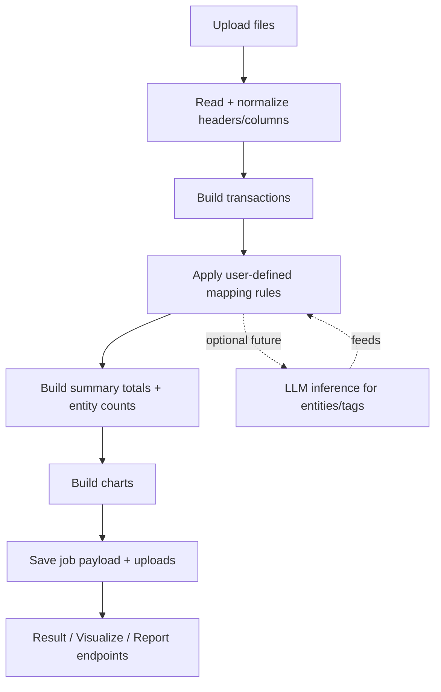
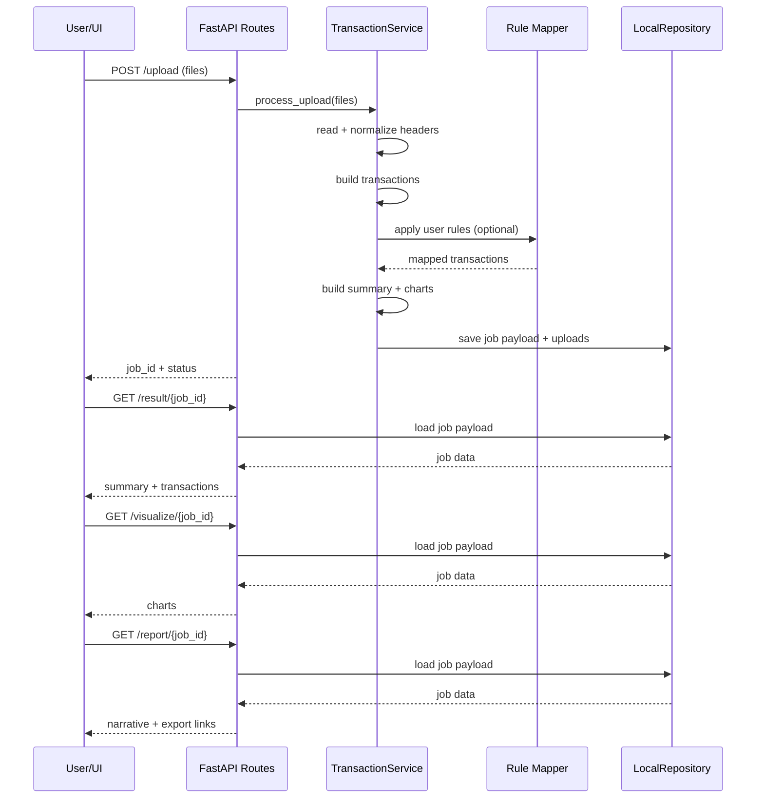

# Processing Flow (Current + Planned)

```mermaid
flowchart TD
    A[Upload files] --> B[Read + normalize headers/columns]
    B --> C[Build transactions]
    C --> D[Apply user-defined mapping rules]
    D --> E[Build summary totals + entity counts]
    E --> F[Build charts]
    F --> G[Save job payload + uploads]
    G --> H[Result / Visualize / Report endpoints]

    D -. optional future .-> LLM[LLM inference for entities/tags]
    LLM -. feeds .-> D
```

```mermaid
sequenceDiagram
    participant U as User/UI
    participant API as FastAPI Routes
    participant SVC as TransactionService
    participant MAP as Rule Mapper
    participant REP as LocalRepository

    U->>API: POST /upload (files)
    API->>SVC: process_upload(files)
    SVC->>SVC: read + normalize headers
    SVC->>SVC: build transactions
    SVC->>MAP: apply user rules (optional)
    MAP-->>SVC: mapped transactions
    SVC->>SVC: build summary + charts
    SVC->>REP: save job payload + uploads
    API-->>U: job_id + status

    U->>API: GET /result/{job_id}
    API->>REP: load job payload
    REP-->>API: job data
    API-->>U: summary + transactions

    U->>API: GET /visualize/{job_id}
    API->>REP: load job payload
    REP-->>API: job data
    API-->>U: charts

    U->>API: GET /report/{job_id}
    API->>REP: load job payload
    REP-->>API: job data
    API-->>U: narrative + export links
```
